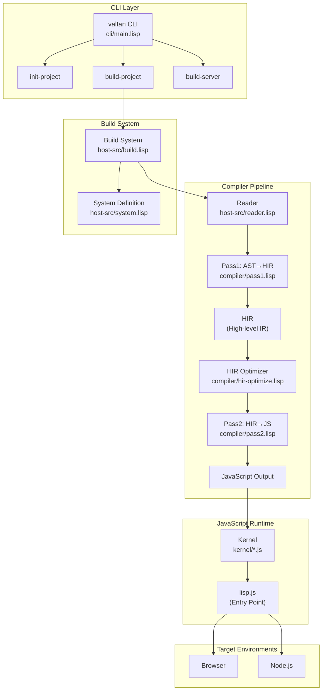
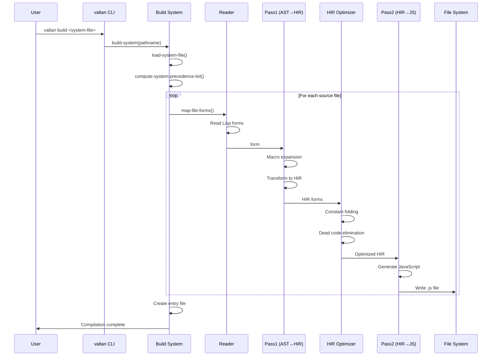

# Valtan Architecture

## 1. Overview

### Purpose
Valtan is a Common Lisp to JavaScript compiler that enables running Common Lisp code in web browsers and Node.js environments.

### Use Cases
- Compile Common Lisp source files to JavaScript modules
- Build browser-based applications using Common Lisp
- Build Node.js applications using Common Lisp
- Integrate with modern JavaScript tooling (Vite, Webpack)
- React application development using Common Lisp

### Non-Goals
- Full ANSI Common Lisp compliance (subset implementation)
- Native code compilation
- Standalone binary generation for non-JS targets

## 2. System Architecture



## 3. Execution Flow

### Compilation Sequence



## 4. Modules & Dependencies

### Layer Architecture

```
┌─────────────────────────────────────────────────────┐
│                    CLI Layer                         │
│  valtan-cli.asd: init, build, build-server          │
├─────────────────────────────────────────────────────┤
│                  Host Layer                          │
│  valtan.asd: build, system, reader, emitter-stream  │
├─────────────────────────────────────────────────────┤
│                Compiler Layer                        │
│  valtan-core/compiler: pass1, pass2, hir-optimize   │
├─────────────────────────────────────────────────────┤
│              Common Lisp Layer                       │
│  valtan-core/common-lisp: control, cons, sequence...│
├─────────────────────────────────────────────────────┤
│               JavaScript Runtime                     │
│  kernel/*.js: symbol, cons, function, package...    │
└─────────────────────────────────────────────────────┘
```

### Key Packages

| Package | Purpose | Location |
|---------|---------|----------|
| `valtan-cli` | CLI entry point | `cli/main.lisp:1-28` |
| `valtan-host.build` | Build orchestration | `host-src/build.lisp:1-437` |
| `valtan-host.system` | System definition | `host-src/system.lisp:1-203` |
| `compiler` | Compilation pipeline | `library/valtan-core/compiler/` |
| `valtan-core` | Target runtime library | `library/valtan-core/lisp/` |

### External Dependencies

From `valtan.asd:2-8`:
- `cl-ppcre` - Regular expressions
- `trivial-gray-streams` - Stream abstractions
- `cl-source-map` - JavaScript source map generation
- `inotify` (Linux) - File watching for build-server
- `async-process` - Process management
- `st-json` - JSON handling

### Internal Module Dependencies

```
valtan-cli
    └── valtan
            ├── cl-source-map
            ├── async-process
            └── valtan-core
                    ├── valtan-core/compiler
                    │       └── valtan-core/common-lisp
                    │               └── valtan-core/system
                    └── valtan-core/common-lisp
```

## 5. Compiler Components

### HIR (High-level Intermediate Representation)

Defined in `library/valtan-core/compiler/hir.lisp:3-9`:

```lisp
(defstruct (hir (:constructor %make-hir))
  op
  return-value-p
  multiple-values-p
  (result-type t)
  position
  args)
```

### HIR Operations

| Operation | Description | Reference |
|-----------|-------------|-----------|
| `const` | Constant value | `pass1.lisp:352-353` |
| `lref` | Local variable reference | `pass1.lisp:359-370` |
| `gref` | Global variable reference | `pass1.lisp:359-370` |
| `lset`/`gset` | Local/global assignment | `pass1.lisp:618-653` |
| `if` | Conditional | `pass1.lisp:655-663` |
| `progn` | Sequential execution | `pass1.lisp:665-671` |
| `lambda` | Function definition | `pass1.lisp:462-486` |
| `let` | Variable binding | `pass1.lisp:707-740` |
| `call`/`lcall` | Function call | `pass1.lisp:527-585` |
| `block`/`return-from` | Block control | `pass1.lisp:825-848` |
| `tagbody`/`go` | Goto control | `pass1.lisp:861-922` |

### Pass1: Lisp → HIR

Key functions in `library/valtan-core/compiler/pass1.lisp`:
- `pass1`: Main entry point for form compilation (line 587-613)
- `pass1-toplevel`: Top-level form compilation (line 1136-1139)
- `parse-lambda-list`: Lambda list parsing (line 115-237)
- `%macroexpand-1`: Macro expansion (line 506-525)

### Pass2: HIR → JavaScript

Key functions in `library/valtan-core/compiler/pass2.lisp`:
- `p2`: Main HIR to JavaScript emitter (line 239-244)
- `p2-toplevel-forms`: Compile multiple HIR forms (line 1191-1212)
- `p2-literal`: Lisp value to JavaScript literal (line 369-371)
- `p2-emit-lambda-list`: Lambda list code generation (line 545-607)

### Builtin Functions Table

`library/valtan-core/compiler/pass2.lisp:44-145` defines optimized JavaScript implementations for common functions:
- Symbol operations: `symbolp`, `boundp`, `fboundp`
- Number operations: `%add`, `%sub`, `%mul`, etc.
- Cons operations: `consp`, `cons`, `%car`, `%cdr`
- Control: `eq`, `values`, `apply`

## 6. JavaScript Runtime (Kernel)

### Kernel Modules

| File | Purpose | Reference |
|------|---------|-----------|
| `lisp.js` | Main entry, function registration | `kernel/lisp.js:1-275` |
| `symbol.js` | Symbol implementation | `kernel/symbol.js` |
| `package.js` | Package system | `kernel/package.js` |
| `cons.js` | Cons cell implementation | `kernel/cons.js` |
| `values.js` | Multiple values | `kernel/values.js` |
| `function.js` | Function call machinery | `kernel/function.js` |
| `number.js` | Numeric operations | `kernel/number.js` |
| `structure.js` | Structure (defstruct) support | `kernel/structure.js` |
| `character.js` | Character type | `kernel/character.js` |
| `control.js` | Control flow primitives | `kernel/control.js` |
| `error.js` | Error handling | `kernel/error.js` |
| `callstack.js` | Call stack for debugging | `kernel/callstack.js` |
| `ffi.js` | JavaScript interop | `kernel/ffi.js` |

### Function Registration Pattern

From `kernel/lisp.js:167-192`:
```javascript
function registerFunction(pkg, name, fn, min = 0, max = min) {
    // Wraps functions with argument checking
    intern(name, pkg).func = function() { ... }
}
```

## 7. FFI (Foreign Function Interface)

### FFI Special Forms

Defined in `library/valtan-core/lisp/ffi.lisp`:

| Form | Purpose | Reference |
|------|---------|-----------|
| `ffi:ref` | Access JavaScript properties | `pass1.lisp:1034-1038` |
| `ffi:set` | Set JavaScript properties | `pass1.lisp:1040-1048` |
| `ffi:var` | Declare JavaScript variables | `pass1.lisp:1057-1066` |
| `ffi:new` | JavaScript constructor call | `pass1.lisp:1097-1115` |
| `ffi:aget` | Array access | `pass1.lisp:1117-1127` |
| `ffi:require` | ES6 module import | `pass1.lisp:1068-1080` |
| `ffi:export` | ES6 module export | `pass1.lisp:1082-1087` |
| `ffi:typeof` | JavaScript typeof | `pass1.lisp:1089-1095` |

### JavaScript Interop Syntax

| Syntax | Description | Output |
|--------|-------------|--------|
| `js:foo-bar` | JS variable reference (kebab→camelCase) | `fooBar` |
| `#j"string"` | JS string literal | `"string"` |
| `(ffi:ref x "prop")` | Property access | `x.prop` |
| `(ffi:object :key val)` | Object creation | `{key: val}` |
| `(ffi:require var "mod")` | Module import | `import ... from "mod"` |

- `docs/js-interop.lisp:1-61`

### React Integration

`define-react-component` macro for React components:

```lisp
(define-react-component <square> (on-click value)
  (jsx (:button (:class-name #j"square" :on-click on-click)
        value)))
```

- `library/react-utilities/react-utilities.lisp`

## 8. Build System

### System Definition Format

From `host-src/system.lisp:117-134`:
```lisp
(defsystem "name"
  :serial t                    ; Sequential compilation
  :source-map t                ; Generate source maps
  :target :browser             ; or :node
  :depends-on ("other-system")
  :entry-file "entry.js"
  :components ((:file "main")
               (:js-source-file "util")))
```

### Build Cache

From `host-src/build.lisp:20-55`:
- Cache stored in `*cache*` hash table
- Cache key: input file pathname
- Cache invalidation: based on file modification time
- Cache directory: `.valtan-cache/`

### Build Process

1. Load system file (`load-system-file`)
2. Compute dependency order (`compute-system-precedence-list`)
3. For each system:
   - For each component: `compile-component`
   - Generate system index file: `compile-system-file`
4. Create entry file: `create-entry-file`
5. (Optional) Run bundler: `webpack`

## 9. Configuration

### Project Configuration Files

| File | Purpose |
|------|---------|
| `*.system` / `*.asd` | System definition |
| `.valtan-path` | Path to kernel directory |
| `.valtan-cache/` | Compilation cache |
| `package.json` | JavaScript dependencies |
| `vite.config.js` | Vite bundler config |

### System Definition Options

| Option | Type | Description |
|--------|------|-------------|
| `:target` | `:node` / `:browser` | Target environment |
| `:source-map` | boolean | Generate source maps |
| `:entry-file` | string | Entry point file |
| `:depends-on` | list | Dependent systems |

### Environment Variables

From `flake.nix:35-39`:
- `CL_SOURCE_REGISTRY` - ASDF source registry paths
- `C_INCLUDE_PATH` - C header paths (for inotify)
- `LIBRARY_PATH` / `LD_LIBRARY_PATH` - Library paths

### Nix Development Shell

From `flake.nix:22-32`:
- SBCL (Steel Bank Common Lisp)
- Node.js 20
- npm
- libfixposix (for inotify)

## 10. Build & Release

### CLI Commands

| Command | Description | Reference |
|---------|-------------|-----------|
| `valtan init` | Initialize new project | `cli/init-project.lisp` |
| `valtan build <system>` | Build system | `cli/build-project.lisp:20-24` |
| `valtan build-server <system>` | Watch mode | `cli/build-server.lisp` |

### Build Executable

From `valtan-cli.asd:12-16`:
```lisp
(defsystem "valtan-cli/executable"
  :build-operation program-op
  :build-pathname "valtan"
  :entry-point "valtan-cli:main")
```

### Test Infrastructure

From `tests/test-runner.lisp`:
- SACLA test suite support
- Category-based test organization
- Modular test runner with verbose/quiet modes
- JSON output for CI integration

Test categories:
- `:cons`, `:array`, `:sequence`, `:string`
- `:character`, `:symbol`, `:hash-table`
- `:loop`, `:reader`, `:printer`
- `:condition`, `:control`, `:do`, `:eval`, `:package`

## 11. Risks & Improvements

### Risks

1. **Incomplete CL Compliance**: Many ANSI CL functions are not implemented or have limited functionality
   - Evidence: Subset of CL implemented in `library/valtan-core/lisp/`

2. **JavaScript Runtime Size**: Full runtime is included even for small programs
   - Evidence: `kernel/lisp.js` imports all modules regardless of usage

3. **Limited Error Messages**: Compilation errors may lack source location context
   - Evidence: `hir-position` optional in HIR structure (`hir.lisp:8`)

4. **Cache Invalidation**: Macro changes may not properly invalidate dependent files
   - Evidence: Cache key is only source file, not transitive dependencies (`build.lisp:39-55`)

5. **Platform-Specific Watch Mode**: `build-server` uses inotify (Linux) or fswatch (macOS)
   - Evidence: Conditional compilation in `build.lisp:387-436`

### Improvements

1. **Tree-shaking**: Implement dead code elimination at JavaScript level to reduce bundle size

2. **Incremental Compilation**: Add dependency tracking for proper incremental builds

3. **Better Diagnostics**: Add source location tracking throughout compilation pipeline

4. **WebAssembly Target**: Consider WASM as alternative backend for performance-critical code

5. **TypeScript Definitions**: Generate `.d.ts` files for better IDE integration

6. **Hot Module Replacement**: Integrate with Vite/Webpack HMR for development

## 12. Open Questions

1. **Type Inference Scope**: How extensive is the type inference in `hir-optimize`?
   - `type-infer.lisp` exists but unclear how types are used

2. **Self-Hosting Status**: Can Valtan compile itself?
   - `#+valtan` conditionals suggest partial self-hosting capability

3. **CLOS Support Level**: What subset of CLOS is implemented?
   - `clos.lisp` exists but scope unclear

4. **Memory Management**: How is garbage collection handled?
   - Relies on JavaScript GC, but circular reference handling unclear

5. **Debugging Support**: Is there a debugger or just source maps?
   - `callstack.js` provides backtrace but no interactive debugging

## 13. References

### Core System Definitions
- `valtan.asd:1-16`
- `valtan-cli.asd:1-16`
- `library/valtan-core/valtan-core.asd:1-73`

### Compiler Pipeline
- `library/valtan-core/compiler/pass1.lisp:1-1151`
- `library/valtan-core/compiler/pass2.lisp:1-1213`
- `library/valtan-core/compiler/hir.lisp:1-202`
- `library/valtan-core/compiler/hir-optimize.lisp:1-100+`

### Build System
- `host-src/build.lisp:1-437`
- `host-src/system.lisp:1-203`

### JavaScript Runtime
- `kernel/lisp.js:1-275`
- `kernel/symbol.js`
- `kernel/package.js`
- `kernel/cons.js`

### FFI
- `library/valtan-core/lisp/ffi.lisp:1-96`
- `kernel/ffi.js`
- `docs/js-interop.lisp:1-61`

### Tests
- `tests/test-runner.lisp:1-245`
- `tests/sacla-tests/` (external test suite)
