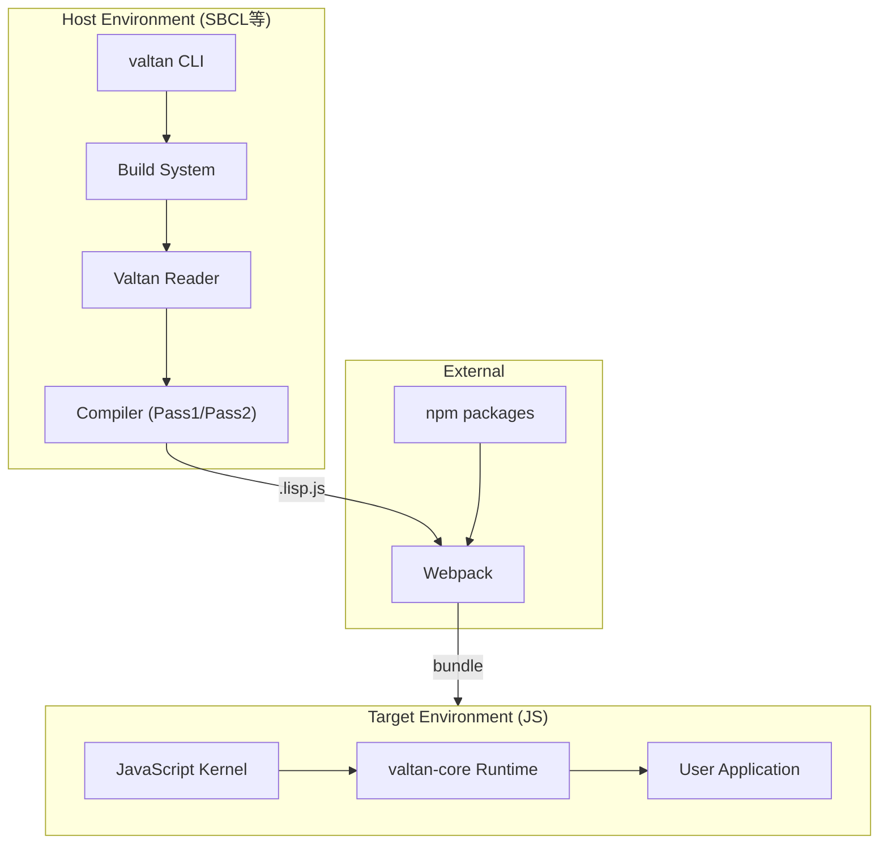
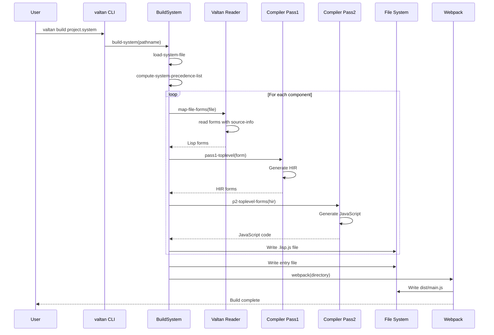

# ARCHITECTURE

## 1. Overview

### 目的
ValtanはCommon LispからJavaScriptへのコンパイラ。ブラウザやNode.js環境でCommon Lispコードを実行可能にする。

### ユースケース
- Common LispでReactコンポーネントを記述
- Node.jsアプリケーションをCommon Lispで開発
- 既存のCommon Lispコードをブラウザで実行

### 非目標
- 完全なANSI Common Lisp準拠（アルファ段階）
- ネイティブコンパイル

## 2. System Architecture



## 3. Execution Flow

### コンパイルフロー



## 4. Modules & Dependencies

### レイヤー構成

| レイヤー | 説明 | 主要ファイル |
|---------|------|-------------|
| CLI | コマンドラインインターフェース | `cli/main.lisp:20-27` |
| Build System | ビルド・キャッシュ管理 | `host-src/build.lisp` |
| Compiler | コンパイラ本体 | `library/valtan-core/compiler/` |
| Runtime | JS実行環境 | `kernel/`, `library/valtan-core/lisp/` |

### 外部依存（valtan.asd）

| パッケージ | 用途 |
|-----------|------|
| cl-ppcre | 正規表現 |
| trivial-gray-streams | ストリーム抽象化 |
| cl-source-map | ソースマップ生成 |
| inotify (Linux) | ファイル監視 |
| async-process | 非同期プロセス |
| st-json | JSON処理 |

- `valtan.asd:1-8`

### 内部モジュール構成

```
valtan-core/
├── system        # パッケージ・基本定義
├── common-lisp   # CL実装 (cons, array, string等)
└── compiler      # コンパイラ (pass1, pass2, hir)
```

- `library/valtan-core/valtan-core.asd:3-72`

## 5. Data Model

### HIR (High-level Intermediate Representation)

コンパイラ内部で使用される中間表現。

```lisp
(defstruct hir
  op                   ; 操作種別
  return-value-p       ; 戻り値使用フラグ
  multiple-values-p    ; 多値フラグ
  result-type          ; 結果型
  position             ; ソース位置
  args)                ; 引数リスト
```

- `library/valtan-core/compiler/hir.lisp:3-9`

### System定義

```lisp
(defstruct system
  name
  pathname
  components
  enable-profile
  enable-source-map
  depends-on
  target              ; :node | :browser | nil
  entry-file)
```

- `host-src/system.lisp:30-38`

## 6. External Integrations

### JavaScript FFI

| 構文 | 説明 | 出力例 |
|------|------|--------|
| `js:foo-bar` | JS変数参照 (kebab→camelCase) | `fooBar` |
| `#j"string"` | JS文字列リテラル | `"string"` |
| `(ffi:ref x "prop")` | プロパティアクセス | `x.prop` |
| `(ffi:object :key val)` | オブジェクト生成 | `{key: val}` |
| `(ffi:require var "mod")` | モジュールインポート | `require("mod")` |

- `docs/js-interop.lisp:1-61`
- `library/valtan-core/lisp/ffi.lisp:1-96`

### React統合

`define-react-component`マクロでReactコンポーネントを定義可能。

```lisp
(define-react-component <square> (on-click value)
  (jsx (:button (:class-name #j"square" :on-click on-click)
        value)))
```

- `library/react-utilities/react-utilities.lisp:12-31`

### WebSocket (Remote Eval)

ブラウザ上で動的コード評価を実現。Lemエディタと連携可能。

- `library/remote-eval/remote-eval.lisp:6-33`
- WebSocket接続先: `ws://0.0.0.0:40000/`

## 7. Configuration

### プロジェクト設定ファイル

| ファイル | 用途 |
|----------|------|
| `*.system` / `*.asd` | システム定義 |
| `package.json` | npm依存・ビルドスクリプト |
| `webpack.config.js` | バンドル設定 |
| `.valtan-path` | カーネルパス（自動生成） |
| `.valtan-cache/` | コンパイルキャッシュ |

### System定義オプション

| オプション | 型 | 説明 |
|-----------|-----|------|
| `:target` | `:node` / `:browser` | ターゲット環境 |
| `:source-map` | boolean | ソースマップ生成 |
| `:entry-file` | string | エントリーポイント |
| `:depends-on` | list | 依存システム |

- `host-src/system.lisp:117-134`

## 8. Build & Release

### ビルドコマンド

```bash
# CLIビルド
make build

# プロジェクト初期化
valtan init project-name [-t browser|node]

# プロジェクトビルド
valtan build project.system

# ビルドサーバー（ファイル監視）
valtan build-server project.system
```

- `Makefile:1-14`
- `cli/main.lisp:20-27`

### npm統合

```json
{
  "scripts": {
    "prebuild": "valtan build project.system",
    "build": "webpack",
    "start": "npm run build && node dist/main.js"
  }
}
```

- `skeleton/node-skeleton/package.json:6-10`

### テスト

Sacla Common Lisp Test Suiteを使用。

```bash
cd tests
npm install
npm start
```

- `tests/main.lisp:1`
- テスト結果: `README.md:72-97`

## 9. Risks & Improvements

### リスク

1. **ANSI Common Lisp互換性が不完全**
   - 多くのテストケースで失敗（例: must-sequence.lisp 6/3853）
   - `README.md:85`

2. **ドキュメント不足**
   - FFI仕様が`docs/js-interop.lisp`のみ
   - APIリファレンスなし

3. **エラーハンドリングの制限**
   - コンパイルエラー時のスタックトレースが不明瞭
   - `host-src/build.lisp:397-400`

4. **依存関係のバージョン固定なし**
   - webpack 4.xを使用（古い）
   - `skeleton/node-skeleton/package.json:16-17`

### 改善案

1. **テストカバレッジ向上**
   - ansi-testの完全サポートを目標に
   - `README.md:60-66`

2. **ソースマップの改善**
   - デバッグ体験向上
   - `host-src/build.lisp:122-132`

3. **インクリメンタルコンパイル強化**
   - 現在のキャッシュ機構を拡張
   - `host-src/build.lisp:39-55`

4. **型推論の活用**
   - `compiler/type-infer.lisp`が存在するが限定的使用
   - `library/valtan-core/valtan-core.asd:63`

5. **ES Modules対応**
   - CommonJS形式からの移行
   - モダンバンドラーとの互換性向上

## 10. Open Questions

1. **CLOS実装の完全性**
   - `clos.lisp`は48KB超だが、MOP対応範囲は未確認

2. **マルチスレッド/Web Worker対応**
   - 現状の対応状況不明

3. **BigInt対応**
   - 大きな整数の扱い方針

4. **Tree Shaking**
   - 未使用コード除去の仕組み

5. **ホットリロード**
   - `build-server`の詳細な動作仕様

## 11. References

### 主要ファイル

| ファイル | 行 | 内容 |
|----------|-----|------|
| `valtan.asd` | 1-16 | メインシステム定義 |
| `valtan-cli.asd` | 1-16 | CLI定義 |
| `cli/main.lisp` | 20-27 | CLIエントリーポイント |
| `host-src/build.lisp` | 137-159 | コンパイル処理 |
| `host-src/build.lisp` | 345-351 | ビルドシステム |
| `host-src/system.lisp` | 30-38 | System構造体 |
| `host-src/system.lisp` | 117-134 | defsystemマクロ |
| `library/valtan-core/valtan-core.asd` | 3-72 | コアシステム定義 |
| `library/valtan-core/compiler/hir.lisp` | 3-9 | HIR構造体 |
| `library/valtan-core/compiler/pass1.lisp` | 1-114 | Pass1処理 |
| `library/valtan-core/compiler/pass2.lisp` | 1-100 | Pass2処理 |
| `kernel/lisp.js` | 1-275 | JSカーネル |
| `library/valtan-core/lisp/ffi.lisp` | 1-96 | FFI実装 |
| `library/react-utilities/react-utilities.lisp` | 1-122 | React統合 |
| `docs/js-interop.lisp` | 1-61 | FFIドキュメント |
| `README.md` | 1-108 | プロジェクト概要 |
